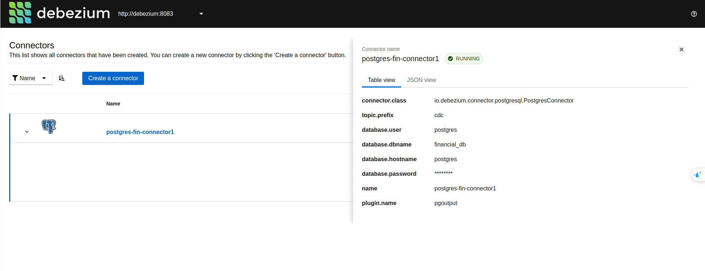
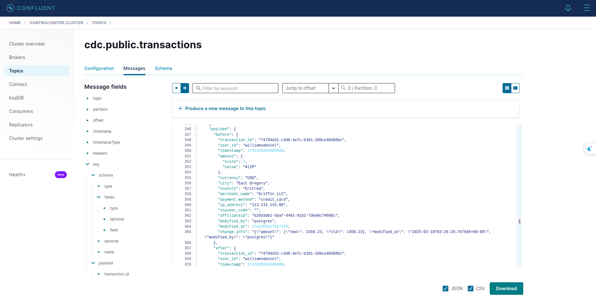
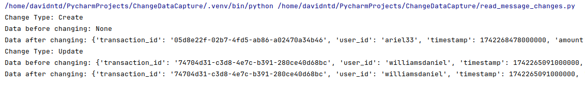

# Realtime Change data capture - Detect changes from various OLTP databases

## Table of Contents
- [Introduction](#introduction)
- [Features](#features)
- [Technologies Used](#technologies-used)
- [Data Pipeline](#data-pipeline)
- [Visualizations](#visualizations)
- [Conclusion](#concly)

## Introduction
- This project utilizes the power of Combining Debezium and Kafka-connect to capture the changes in OLTP databases. The application can automatically detect the changes and send them to the Kafka topic.

## Features
- **Automated Change data capture**: Using Debezium as a top layer of Kafka to capture the changes of PostgreSQL
- **Docker Compose Setup**: The project uses Docker Compose to streamline the deployment and management of the required services, including Apache Kafka, Apache ZooKeeper, Debezium and PostgreSQL.

## Technologies Used
- **PostgreSQL**: To store data as a source of changes.
- **Apache Kafka**: Processing data in real-time through passing and receiving messages in topics.
- **Apache ZooKeeper**: Managing Kafka broker.
- **Debezium**: Act as the top layer of Apache Kafka, capturing all of the changes happening in PostgreSQL.
- **Docker Compose**: To orchestrate the deployment of the above technologies.

## Data Pipeline

## Visualization
- **Debezium-PostgreSQL connector**

- **Confluent Kafka Control Center**
  

- **Result of changes**
  

  ## Conclusion
  - With the fundamental understanding of applying Debezium for change data capturing, you can apply on your own cases and specific needs.
  
